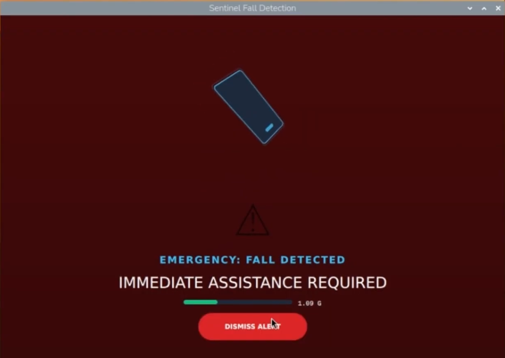

# Sentinel Fall Detector

<!-- LOGO placeholder -->
[](https://youtu.be/NepWSkGp3WA)


A real-time fall detection system for the Raspberry Pi 5 that uses an LSM6DSO32 IMU sensor to distinguish genuine falls from everyday movements like sitting down. It combines Kalman-filtered sensor fusion, a multi-stage fall detection state machine, and FFT-based gait analysis to deliver accurate alerts with a modern Qt Quick dashboard.


<!-- Ideal screenshot: the Qt Quick dashboard in its default "SYSTEM MONITORING" state showing the 3D device model, force meter at ~1.00 G, and the deep slate background. A second screenshot showing the crimson "EMERGENCY: FALL DETECTED" state would also be valuable. -->

---

## Table of Contents

- [About The Project](#about-the-project)
- [Getting Started](#getting-started)
- [Usage](#usage)
- [Roadmap](#roadmap)
- [License](#license)
- [Contact](#contact)

---

## About The Project

### Motivation

Consumer fall detection solutions are often opaque, expensive, or locked into proprietary ecosystems. Sentinel Fall Detector is an open, transparent implementation built on commodity hardware that demonstrates how multi-stage signal processing can separate real falls from false positives — a problem that plagues simpler threshold-based detectors. It serves as both a functional prototype and a reference architecture for IMU-based safety systems.

### Key Features

- **Kalman-Filtered Orientation Tracking** — A 2-state Kalman filter fuses accelerometer and gyroscope data to produce stable roll and pitch estimates that resist noise and drift.
- **Multi-Stage Fall Detection** — A three-phase state machine (freefall detection, impact detection, decision matrix) classifies events as hard falls, safe sitting, posture shifts, or benign impacts by comparing current state against a 500ms historical buffer.
- **Predictive Gait Analysis** — A radix-2 FFT analyzes 128-sample windows of acceleration magnitude, extracting gait energy (0.5–3.5 Hz) and tremor energy (4–15 Hz) to compute a fall risk score before a fall occurs.
- **Real-Time 3D Dashboard** — A Qt Quick UI renders a 3D device model that mirrors physical orientation in real time, alongside a live force meter, status indicators, and fall risk warnings.
- **False Positive Rejection** — The decision matrix uses relative posture change and vertical velocity to distinguish controlled movements (sitting, stumbling) from genuine falls, preventing false alarms.

### Built With


---

## Getting Started

### Prerequisites

| Requirement | Details |
|---|---|
| **Hardware** | Raspberry Pi 5 with display, LSM6DSO32 IMU sensor via Qwiic Shim (I2C address `0x6A`) |
| **OS** | Raspberry Pi OS or any Linux with I2C support |
| **Compiler** | GCC or Clang with C++17 support |
| **CMake** | Version 3.16 or higher |
| **Qt 6** | Modules: Quick, Core, Gui |
| **I2C Tools** | `i2c-tools` package (for diagnostics) |

### Installation

1. **Enable I2C** on the Raspberry Pi (if not already enabled):
   ```bash
   sudo raspi-config
   # Interface Options → I2C → Enable
   ```

2. **Install dependencies:**
   ```bash
   sudo apt update
   sudo apt install -y cmake qt6-declarative-dev qt6-base-dev i2c-tools
   ```

3. **Verify sensor connectivity:**
   ```bash
   i2cdetect -y 1
   # Address 6a should appear in the grid
   ```

4. **Clone and build:**
   ```bash
   git clone <repository-url>
   cd fall-detection
   cmake -S . -B build
   cmake --build build -j$(nproc)
   ```

---

## Usage

### Running the Application

```bash
./build/FallDetector
```

If GPU drivers are not configured, use the software rendering backend:

```bash
QT_QUICK_BACKEND=software ./build/FallDetector
```

### Remote Deployment to Raspberry Pi

```bash
scp -r ./* user@raspberrypi5:~/Documents/FallDetector/
ssh -t user@raspberrypi5 'cd ~/Documents/FallDetector && cmake -S . -B build && cmake --build build -j$(nproc) && export DISPLAY=:0 && ./build/FallDetector'
```

A preconfigured VSCode task (`Deploy and Run on Pi`) is also available in `.vscode/tasks.json`.

### Dashboard States

| State | Background | Status Text | Trigger |
|---|---|---|---|
| Monitoring | Deep Slate | `Monitoring...` | Default |
| Fall Detected | Crimson Red | `EMERGENCY: FALL DETECTED` | Freefall + high impact + posture change > 45° |
| Safe Descent | Deep Slate | `Sitting Down / Safe Descent` | Controlled downward motion |
| Fall Risk Warning | Amber pulse | `HIGH FALL RISK DETECTED` | Gait risk score > 0.6 |

### Testing Scenarios

Detailed manual validation procedures are documented in [TESTING_GUIDE.md](TESTING_GUIDE.md), covering:

- Kalman filter orientation accuracy
- Hard fall detection and emergency alert
- False alarm rejection (stumbles, taps)
- Daily activity recognition (sitting down)
- Predictive gait analysis with FFT

---

## Roadmap

- [x] Kalman-filtered sensor fusion for roll/pitch estimation
- [x] Multi-stage fall detection with decision matrix
- [x] FFT-based predictive gait analysis
- [x] Real-time Qt Quick dashboard with 3D visualization
- [ ] Automated unit and integration test suite
- [ ] CI/CD pipeline for cross-compilation targeting Raspberry Pi
- [ ] Bluetooth/Wi-Fi alert forwarding to caregiver devices

---

## License

Distributed under the MIT License. See `LICENSE.txt` for more information.

---

## Contact

**Jason Tran**

- Email: [tran219jn@gmail.com](mailto:tran219jn@gmail.com)
- Website: [jasontran.pages.dev](https://jasontran.pages.dev/)
